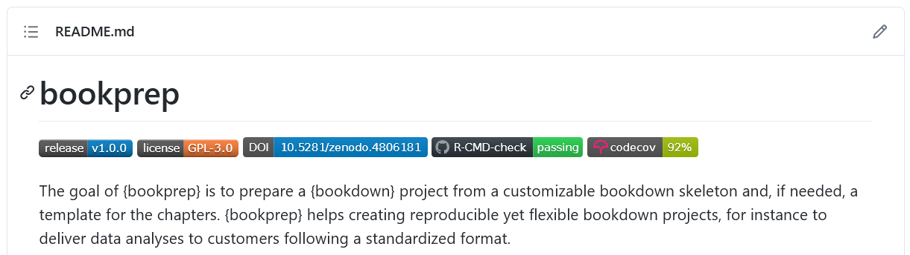
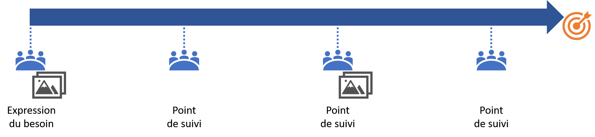
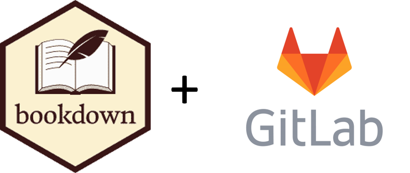
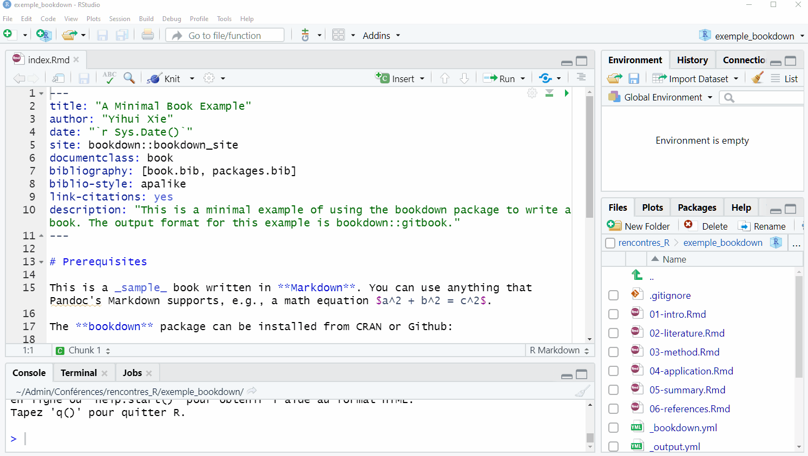
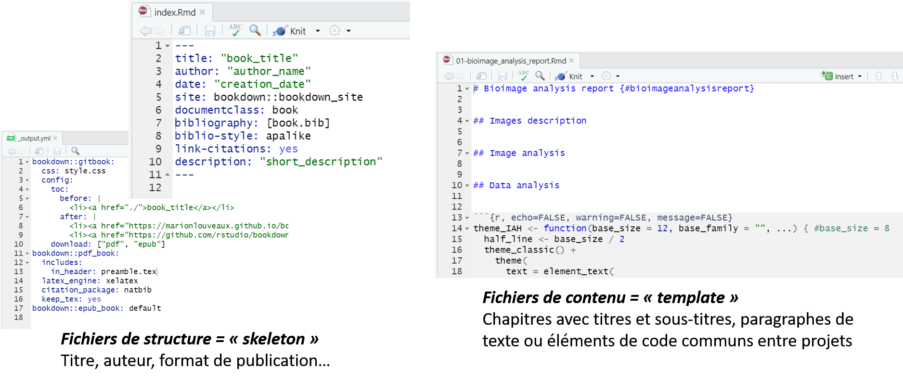
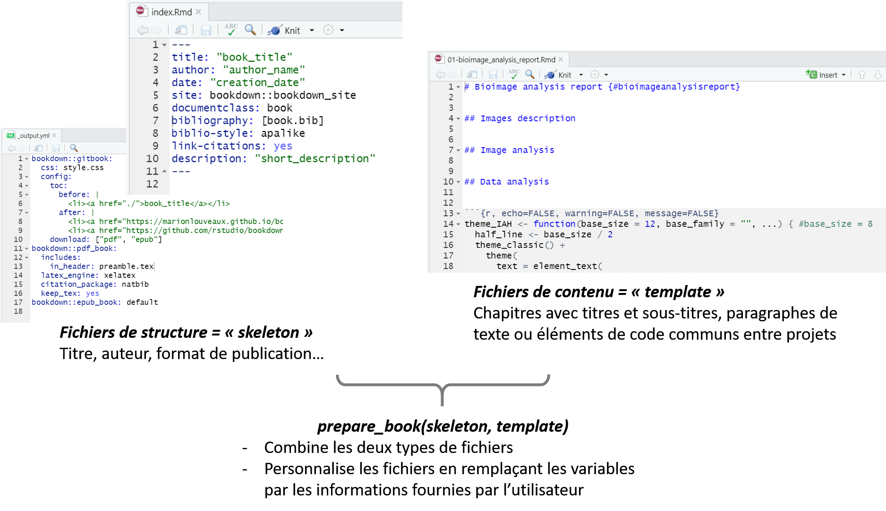

# {bookprep}, en un mot 

```{r, echo=FALSE}

```

- Basé sur **{bookdown}**   
- Pour démarrer un rapport plus rapidement et plus efficacement à partir d'une **structure et d'un contenu prédéfini**    
- Un exemple minimal de package R documenté, testé et versionné          


>https://github.com/marionlouveaux/bookprep 


---
# Contexte : Missions de service 

- **Plateforme de service** en analyse d'images biologiques / analyse de données      
- **Plusieurs projets en parallèle**   
- Un projet peut durer plusieurs mois   
- Un projet peut rester en pause un mois ou deux    


```{r, echo=FALSE}

```


???
Travail pour une plateforme de services en analyse d'images biologiques. Chaque projet commence par une rencontre avec l'utilisateur souhaitant déposer un projet auprès de la plateforme afin de discuter de sa question biologique et de ses besoins et découvrir ses images. Ensuite, le projet commence. Je teste et sélectionne les outils de traitement d'images appropriés pour extraire des informations quantitatives des images, puis je teste et sélectionne les outils d'analyse de données avec R pour répondre aux questions de l'utilisateur. J'automatise autant que possible chaque étape de la chaîne de traitement et d'analyse. 

---
# Approche : communication centralisée et reproductibilité      

**Centralisation** des informations en un seul document :          
- **Suivi des projets par écrit** (rapport)     
- Contenu du rapport :   
    - toutes les étapes de traitement et d'analyse    
    - tous les échanges autour du projet (mails, réunions...).


**Automatisation** des rapports : 
.left-column[
<br>   
<br>  
```{r, echo=FALSE, fig.align='center'}

```
]


.right-column[
- Utilisation de {bookdown}
    - = ensemble structuré de fichiers Rmarkdown   
    - combine texte et code (analyses et résultats)     
- **Suivi de version** avec git     
- **Diffusion via les GitLab pages** 
    - accès permanent au rapport pour tous les membres du projet    
    - lecture au format html    
  
]


???
J'utilise le package R {bookdown} pour écrire un rapport pour le projet. Le package {bookdown} permet de combiner plusieurs fichiers Rmarkdown, et donc de mêler du texte et du code dans un même document.
Dans ce rapport, je consigne les méthodes utilisées, les choix de paramètres et également tous les échanges avec l'utilisateur au long du projet. Je garde une copie de ces fichiers sur le serveur GitLab de l'institut et j'utilise les GitLab pages pour afficher le rapport au format html. Tous les acteurs du projet ont accès à la page GitLab du rapport dès le démarrage du projet.       
  

---
# Problème : démarrage du rapport laborieux  

- Idéalement, rapport commencé dès la première réunion
- Il y a **de nombreux éléments à modifier à la main**   

```{r, echo=FALSE, out.width="70%", fig.align='center'}

```


- Certains éléments sont communs à tous les rapports         
    - Structure commune (chapitres, titres et sous-titres...)      
    - Informations communes (remerciements, thème des graphiques...)   
   
=> **Besoin d'une solution** plus **rapide et** plus **fiable** qui s'appuie sur ces éléments communs.           


???

Identifier les points

- Eviter les taches répétitives et automatisables
- Reduire les risques d'erreur car tâches peu intéressantes
- Utiliser mon temps de cerveau pour répondre au besoin plutôt qu'à des copier-coller


Je commence ce rapport dès la première réunion de discussion des besoins. J'utilise toujours la même structure de rapport et je répète certaines informations d'un rapport à l'autre, notamment un paragraphe rappelant l'importance d'inclure la plateforme dans les remerciements si le projet abouti à une publication scientifique, mais aussi des éléments de code, tels qu'un thème commun pour les graphiques.     
Problème: le démarrage du rapport est un peu laborieux car je dois modifier de nombreuses informations à la main. 

---
# Création de {bookprep}


```{r, echo=FALSE}

```


Un document {bookdown} est composé de **deux types de fichiers** : 
- des fichiers qui structurent le livre = le squelette (**skeleton**)     
- des fichiers de contenu et d'apparence = le modèle de document (**template**)   

>https://github.com/marionlouveaux/bookprep 


---
# Création de {bookprep}

```{r, echo=FALSE}

```

>https://github.com/marionlouveaux/bookprep 


???
Dans {bookprep} : 
- les fichiers de structure ne contiennent plus d'informations "en dur", mais des variables modifiables    
- les fichiers de contenu sont prédéfinis par l'utilisateur du package   

{bookprep} combine les deux types de fichiers et remplace les variables par les informations personnelles de l'utilisateur. 


